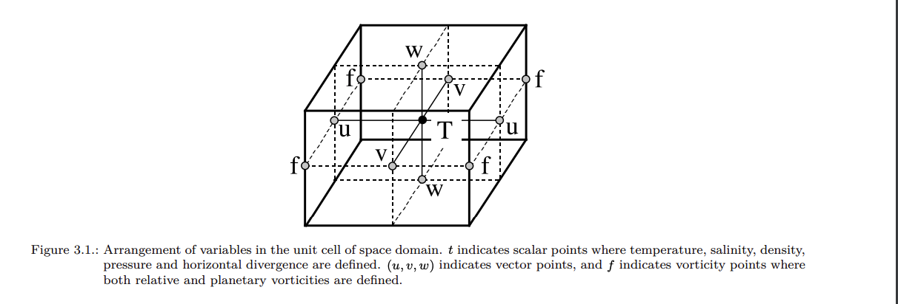
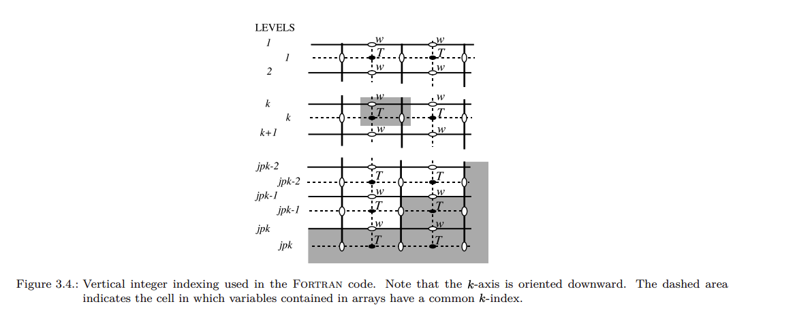

# Restart.ipynb
### *Update of restart files for NEMO* 

The objective is to update the last restart file to initialize the jump. For this we need the 340 restarts files of the last simulated year. We also need the predictions of the sea surface height (zos or ssh), the salinity (so) and temperature (thetao). And the Mask dataset of the corresponding simulation where several informations are needed.

### Maskdataset  
**The Maskdataset contains mask on all grids, vectors and constants**
  
- dimensions t:1 y:331 x:360 z:75  
- umask : continent mask for u grid (continent : 0, sea : 1)  
- vmask : continent mask for v grid (continent : 0, sea : 1)
- e3t_0 : thickness of cell on z axis on grid T  (e:thickness, i:direction, t:grid, 0:initial state / ref) = e3t_ini restart
- e2t   : thickness of cell on y axis on grid T  
- e1t   : thickness of cell on y axis on grid T

### Features  
- zos        : Predicted sea surface height (ssh) - grid T - t,y,x  
- so         : Predicted salinity - grid T - t,z,y,x  
- thetao     : Predicted temperature - grid T - t,z,y,x
#- deptht    : depth of the z axis - grid T
- deptht     : depuis e3t
- rho_insitu : In-situ density (kg/m**3) - Equation of state of Sea-water and related utilities by Julien Le Sommer
- sigma_n    : Potential density referenced to pressure n*1000dB (kg/m**3) - Equation of state of Sea-water and related utilities by Julien Le Sommer

### Restart file 
**The restart files contains all physical and dynamical features of the simulation**
  
There is a total of 340 restart file per year. Each file contains a slice of x and y dimensions.   
58 data variables which 15 are updates using the predictions  
  
**Now and before (n/b) (total of 10 features):**
- ssh   :  sea surface height       => last prediction of zos
- s     :  sea salinity             => last prediction of so
- t     :  sea temperature          => last prediction of thetao
- v     :  zonal velocity           => *The planetary ocean* by Michèle Fieux p70
$$V(z)=\frac{g}{p \cdot f} \cdot \int_{z_0}^{Z} \frac{\partial \rho}{\partial x}dz + V_O$$
- u     :  meridional velocity      => *The planetary ocean* by Michèle Fieux p70
$$U(z)=\frac{g}{p \cdot f} \cdot \int_{z_0}^{Z} \frac{\partial \rho}{\partial y}dz + U_O$$

Pour now et before on met les même états : Le restart n'a besoin que d'une image - flou euler forward (t->t+1) diff simu en cours plusieurs pas de temps 

**5 other features to update:**
- sss_m : sea surface salinity     => last prediction of so
- sst_m : sea surface temperature  => last prediction of thetao
- ssu_m : sea surface u velocity   => From new u
- ssv_m : sea surface v velocity   => From new v
- rhop  : Potential density referenced to pressure n*1000dB (kg/m**3) sigma_n ou n=0
- e3t   : depuis  e3t_ini & ssh => bathy => e3t 

annexe :

Grid T : variables scalaires
U
V
W
F
